<p align="center">
  
</p>

A vendor-agnostic, parameterized INT8 CNN accelerator IP core designed for FPGA-based edge AI inference.

⚡ Target: 128×128 real-time convolution acceleration  
🧠 Architecture: Pipelined 3×3 Quantized Convolution Engine  
📦 Status: Active Development (Month 1 Roadmap)

---

# 📌 Project Status

🟡 Phase: Architecture & Base RTL Implementation  
📅 Development Period: 1 Month  
🔄 Weekly Progress Updates: Enabled  
📢 Open for Contributors  

---

# 🎯 Project Goals (Month 1)

- [ ] Design clean parameterized RTL architecture  
- [ ] Implement 3×3 INT8 Convolution Core  
- [ ] Build Line Buffer + Sliding Window  
- [ ] Add ReLU Activation  
- [ ] Verify using testbench  
- [ ] Achieve 1 pixel per clock (pipelined mode)  
- [ ] Synthesize using open-source toolchain  
- [ ] Publish benchmark results  

---

# 🧠 Target Configuration (Development Version)

```verilog
parameter DATA_WIDTH     = 8;
parameter IMG_WIDTH      = 128;
parameter IMG_HEIGHT     = 128;
parameter KERNEL_SIZE    = 3;
parameter IN_CHANNELS    = 1;
parameter OUT_CHANNELS   = 4;   // Reduced for early testing
parameter MAC_UNITS      = 9;
🏗 Development Roadmap (4 Weeks Plan)
📅 Week 1 – Architecture & Base Modules

Setup repository structure

Define top-level CNN module

Implement:

MAC unit

Accumulator

Write basic testbench

Run simulation

Deliverable:
✔ Verified single 3×3 convolution block

📅 Week 2 – Memory System

Implement Line Buffer (BRAM-based)

Build Sliding Window Generator

Integrate convolution pipeline

Validate 128×128 streaming input

Deliverable:
✔ Full convolution pipeline working in simulation

📅 Week 3 – Optimization & Pipelining

Add pipeline registers

Achieve 1 pixel per clock

Add ReLU module

Optimize resource utilization

Deliverable:
✔ Timing-stable RTL

📅 Week 4 – Synthesis & Benchmarking

Synthesize design

Measure:

LUT usage

BRAM usage

Maximum frequency

Benchmark against CPU implementation

Deliverable:
✔ Performance report published

📂 Repository Structure
cnn-accelerator-ip/
│
├── rtl/
│   ├── cnn_top.v
│   ├── conv2d.v
│   ├── mac_unit.v
│   ├── line_buffer.v
│   ├── relu.v
│
├── tb/
│   ├── tb_conv.v
│
├── synthesis/
│
├── docs/
│
├── benchmarks/
│
└── progress_logs/
🔄 Weekly Update Policy

Each week includes:

Code commits

Simulation results

Resource utilization reports

Optimization improvements

Bug fixes

Progress will be documented inside:

progress_logs/Week-X-Progress.md
📊 Target Performance

For 128×128 input:

Pixels: 16,384

At 100 MHz:

≈ 163 µs per output channel

Expected Speedup vs CPU: 20× – 200×

💾 Memory Strategy

BRAM-based line buffers

Sequential output channel processing

Streaming interface (board-independent)

🔌 Interface (Initial Version)
input clk;
input rst;

input input_valid;
input [7:0] input_data;

output output_valid;
output [7:0] output_data;

Future:

AXI-Stream support

AXI-Lite control interface

🛠 Toolchain

Open-source FPGA flow:

Verilator (Simulation)

Yosys (Synthesis)

nextpnr (Place & Route)

Vendor lock-in free.

🔥 Long-Term Roadmap

Multi-channel parallel support

Depthwise convolution

BatchNorm fusion

AXI-Lite control interface

Full CNN layer chaining

FPGA SoC integration

🤝 Contribution Guidelines

We welcome:

RTL optimizations

Additional layer support

Testbench improvements

Documentation contributions

Please open issues for feature requests or bug reports.

📜 License

MIT License

⭐ Vision

To build a reusable, open-source CNN accelerator IP core enabling high-performance Edge AI on FPGA platforms without vendor dependency.


---

If you want, next I can give:

- ✅ `CONTRIBUTING.md`
- ✅ `LICENSE` file content
- ✅ Week-1 progress template
- ✅ Professional badges for top of README
- ✅ GitHub project board setup guide

Tell me what you want next 🔥
